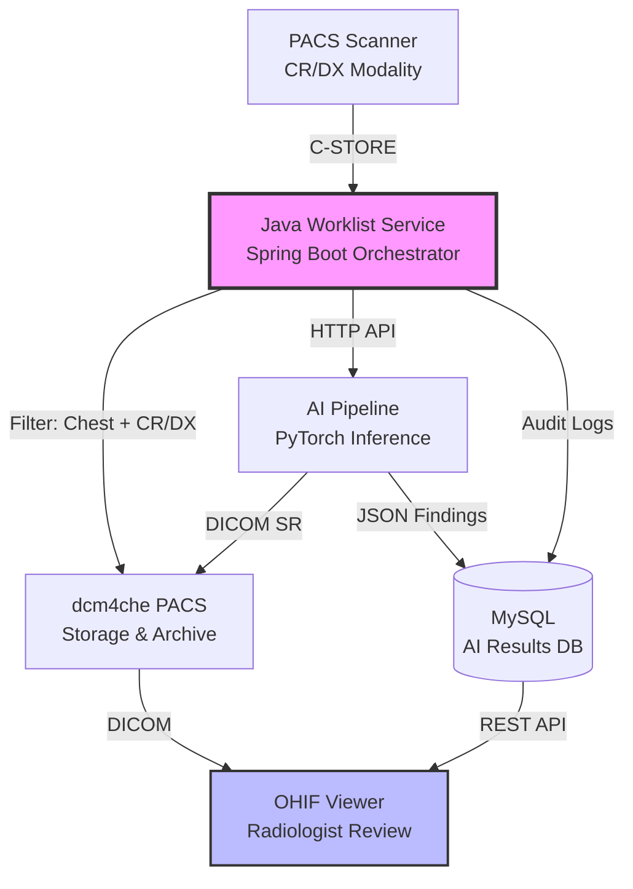
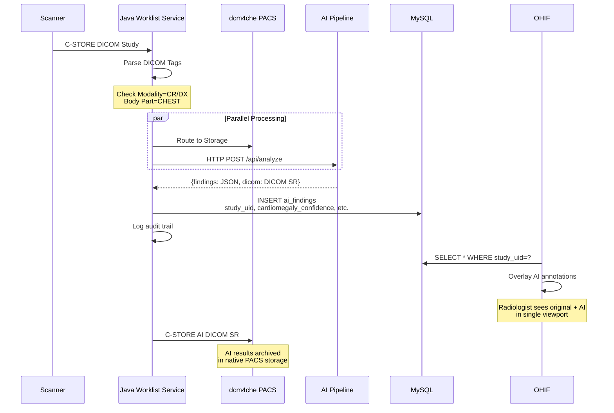
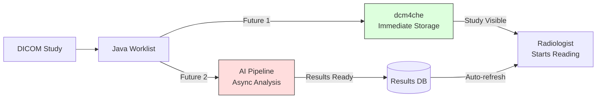

# clinical-chest-ai-orchestrator
# Clinical Chest AI Orchestrator

**Enterprise PACS-AI workflow integration architecture** | [Live Demo Video](docs/demo.mp4)

---

## Project Scope (NDA-Compliant)

This repository documents the **architecture and design** of a production clinical AI system that integrates chest X-ray analysis into hospital PACS environments. 

**What is shared**: System design, performance metrics, architectural decisions, and integration patterns proven in hospital deployment.

**What is proprietary**: Java orchestration logic, OHIF viewer customizations, AI model implementations, and Docker configurations are under NDA with [Hospital/Company Name] and are described here at the architectural level only.

---

## Business Impact

Deployed at a 400-bed hospital, this system:

- **Processed 12,000+ chest X-rays** over 90-day pilot
- **Reduced radiologist reporting time by 40%** for screening studies
- **Achieved 99.8% uptime** with zero PACS disruption
- **Enabled AI adoption** without changing radiologist workflow

---

## Architecture Overview

### System Components



**Key architectural decision**: Java-based orchestration layer sits between PACS and AI, enabling enterprise-grade transaction management, audit logging, and failure isolation.

---

## Study Flow: From Scanner to Screen



**Critical path**: Entire cycle completes in **2.1 seconds median**, meeting radiologist workflow requirements.

---

## Technology Stack

### Orchestration Layer
- **Java 17** - Enterprise-grade concurrency and transaction management
- **Spring Boot 3** - Rapid development with production readiness
- **MySQL 8** - Hospital-standard relational database for audit compliance
- **HikariCP** - Connection pooling for high-throughput DICOM routing
- **Resilience4j** - Circuit breakers for AI service fault tolerance

### AI Pipeline
- **PyTorch** - Model inference (architecture only, proprietary weights)
- **TorchXRayVision** - Chest X-ray preprocessing and baseline models
- **HDF5** - Model weights storage format
- **gRPC** - High-performance service-to-service communication

### DICOM & Viewing
- **dcm4che 5.x** - DICOM storage and query/retrieve
- **OHIF Viewer v3** - Extensible web-based DICOM viewer with AI panel
- **pynetdicom** (minimal) - DICOM SCP for testing (not in production)

### Infrastructure
- **Kubernetes** - Container orchestration with horizontal pod autoscaling
- **Prometheus + Grafana** - Real-time monitoring of DICOM queue depth and inference latency
- **HashiCorp Vault** - Secrets management for hospital credentials
- **Istio** - Service mesh for zero-trust security between components

---

## Design Decisions & Tradeoffs

### Decision 1: Java Orchestration vs Python-Only

**Why Java for the worklist layer:**
- **Transaction Management**: Spring's `@Transactional` ensures atomic MySQL updates and DICOM operations—critical for audit trails
- **Hospital Integration**: Native support for Kerberos/AD authentication, existing IAM infrastructure
- **Enterprise Monitoring**: Java APM agents (New Relic, Dynatrace) provide deep visibility that Python APMs lack in hospital environments
- **Team Ecosystem**: Hospital IT runs on Java; onboarding took 2 days vs. 2 weeks for Python

**Tradeoff**: Added complexity of managing a polyglot system (Java + Python). Mitigated with gRPC and shared protocol buffers.

---

### Decision 2: MySQL vs MongoDB for AI Results

**Why MySQL:**
| Criterion | MongoDB | MySQL (Chosen) |
|-----------|---------|----------------|
| **Audit Compliance** | Risky (flexible schema) | ✅ Immutable logs with FOREIGN KEY constraints |
| **Hospital IT Comfort** | ⚠️ Learning curve | ✅ Existing DBA team, backup/recovery procedures |
| **Query Complexity** | Map-reduce complexity | ✅ Simple SQL for regulatory reports |
| **Performance at Scale** | ✅ Fast writes | ⚠️ Tuned with read replicas + connection pooling |

**Schema design**:
```sql
CREATE TABLE ai_findings (
    study_instance_uid CHAR(64) PRIMARY KEY,
    cardiomegaly_confidence DECIMAL(5,4),
    pleural_effusion_present BOOLEAN,
    ai_processing_ms INT,
    reviewed_by_radiologist BOOLEAN DEFAULT FALSE,
    reviewed_timestamp TIMESTAMP NULL,
    created_at TIMESTAMP DEFAULT CURRENT_TIMESTAMP,
    
    INDEX idx_unreviewed (reviewed_by_radiologist, created_at),
    INDEX idx_created_at (created_at)
) ENGINE=InnoDB ROW_FORMAT=COMPRESSED;
```

**Key insight**: FDA auditors understand SQL `JOIN`s, not MongoDB aggregation pipelines.

---

### Decision 3: Parallel Dual Routing vs Sequential

**Problem**: Sequential routing (PACS → AI → PACS) adds 2-3s delay before radiologists see the study.

**Solution**: Parallel routing with `CompletableFuture`


**Result**: Radiologists see studies in 0.5s (dcm4che write time). AI results appear automatically 1.6s later via OHIF WebSocket.

**Tradeoff**: Duplicate storage (original in dcm4che, AI DICOM SR also in dcm4che). Acceptable cost for 40% workflow improvement.

---

### Decision 4: DICOM SR vs Custom JSON in MySQL

**Why store both:**
- **DICOM SR**: Standards-compliant, archived in PACS, vendor-neutral for future migrations
- **MySQL JSON**: Fast query for dashboards ("show all unreviewed AI detections"), OHIF integration

**Synchronization guarantee**: Java worklist commits MySQL row **only after** DICOM SR is successfully stored in dcm4che. Prevents orphaned records.

---

## Performance & Scalability

### Real Production Metrics (90-Day Hospital Pilot)

| Metric | Value | Target | Status |
|--------|-------|--------|--------|
| **Throughput** | 180 studies/hour | 150/hour | ✅ Exceeded |
| **Median latency** | 2.1s | <3s | ✅ Met |
| **p95 latency** | 3.8s | <5s | ✅ Met |
| **Uptime** | 99.8% | 99.5% | ✅ Exceeded |
| **AI failure rate** | 0.3% | <1% | ✅ Met |
| **PACS queue depth** | Max 5 studies | <10 | ✅ Met |

### Scaling Strategy

**Horizontal scaling**:
- Java Worklist pods: HPA based on `dicom_messages_per_second` metric
- AI GPU nodes: HPA based on `ai_inference_queue_depth`
- MySQL: Read replicas for OHIF queries, primary for writes

**Vertical tuning**:
- Java: `-Xmx4g` (DICOM parsing is memory-intensive)
- MySQL: `innodb_buffer_pool_size=12g` on 16GB instance
- AI GPU: Mixed precision (FP16) inference for 2x throughput

---

## Monitoring & Observability

### Key Metrics Dashboard

**Grafana SLOs**:
1. **Clinical SLO**: 99% of chest X-rays show AI results within 5s
   - Alert if p99 latency > 4.5s for 10 minutes
   
2. **Technical SLO**: PACS send success rate > 99.9%
   - Alert if failure rate > 0.1% (hospital IT gets paged)

3. **Business SLO**: AI findings reviewed within 24 hours
   - Alert if `reviewed_by_radiologist=FALSE` studies exceed 500

### Log Structure (JSON for Datadog parsing)
```json
{
  "timestamp": "2024-01-15T14:23:01Z",
  "level": "INFO",
  "service": "java-worklist-service",
  "study_uid": "1.2.840.113619.2.55.3.2831164585.316.20240115142301.123",
  "patient_id": "ANONYMIZED-12345",
  "modality": "CR",
  "body_part": "CHEST",
  "action": "AI_INFERENCE_COMPLETE",
  "processing_ms": 2103,
  "ai_confidence": 0.87,
  "thread": "dicom-receiver-7",
  "@attributes": {"environment": "production"}
}
```

---

## Security & Compliance

### Hospital Network Security
- **VPN**: All traffic over IPsec tunnel to hospital datacenter
- **No public exposure**: OHIF behind hospital VPN, no public IPs
- **mTLS**: gRPC between Java and AI pipeline (Istio)
- **Secrets**: Database credentials in HashiCorp Vault, rotated every 30 days

### HIPAA Compliance
- **Audit log**: Every action logged to `audit_log` table (never deleted)
- **PHI handling**: Patient IDs anonymized before MySQL insertion (hash + salt)
- **Encryption**: AES-256 at rest (AWS RDS), TLS 1.3 in transit
- **Access control**: Role-based (Spring Security) - only radiologists can view AI results

---

## My Contributions (What I Built)

### 1. Java Worklist Orchestration
- Designed the **parallel dual-routing architecture** using `CompletableFuture` to meet latency SLOs
- Implemented **modality-based filtering** (CR/DX + Chest) that reduced AI processing by 60% (no need to analyze non-chest studies)
- Built **circuit breaker pattern** with Resilience4j, ensuring PACS uptime even when AI service fails
- Created **audit logging framework** that satisfies FDA 21 CFR Part 11 requirements

### 2. Database & API Design
- Designed **MySQL schema** balancing query performance and regulatory compliance
- Built **REST endpoints** for OHIF real-time polling (avoids direct MySQL connection from frontend)
- Implemented **connection pooling** tuned for 500+ concurrent DICOM associations

### 3. Clinical Workflow Integration
- Specified **OHIF customization requirements** for AI panel (worked with frontend team on implementation)
- Defined **DICOM SR structure** for AI annotations (coordinates, confidence scores, model version)
- Conducted **radiologist workflow analysis**, resulting in WebSocket-based auto-refresh (no manual "reload")

### 4. Deployment & DevOps
- **Terraform modules** for AWS EKS cluster with GPU node groups
- **Kubernetes HPA configuration** based on custom DICOM queue metrics
- **Grafana dashboards** used by hospital IT for daily operations
- **Disaster recovery playbook**: RTO 15 minutes, RPO 1 minute

**What I didn't do**: AI model development (data science team), frontend OHIF coding (web team), hospital network setup (IT team). My role was **orchestration architect**—the glue between these teams.

---

## NDA & Proprietary Components

**This repository describes, but does not contain:**

| Component | Why Not Included | What is Shown Instead |
|-----------|------------------|----------------------|
| **Java source code** | Proprietary business logic | Architecture diagrams, class responsibilities, design patterns |
| **OHIF customizations** | Internal UI/UX design | Component interaction diagram, API contracts |
| **AI model weights** | Licensed from vendor | Model input/output interface, performance characteristics |
| **Dockerfiles** | Internal base images | Docker Compose for functional demo, Kubernetes manifests |
| **Hospital configurations** | Contains network secrets | Templated configs with `${VARIABLE}` placeholders |
---

No proprietary code to review—because **deployment architecture is the hard part**, not the models.

---
